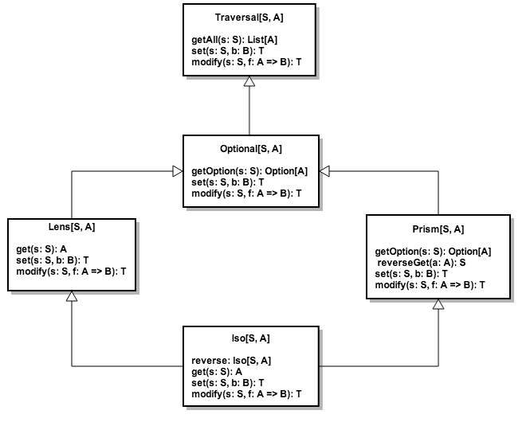

#  Optics Introduction

---

# Lens 

```scala
trait Lens[S, A]{

  def get(s: S): A

  def set(s: S, a: A): S
  def modify(s: S, f: A => A): S
  
  def compose[B](other: Lens[A, B]): Lens[S, B]
}
```
---

# Lens Laws

```scala


∀ s: S       => set(s, get(s)) == s 
∀ s: S, a: A => get(set(s, a)) == a 

∀ s: S, a: A  => set(s, set(s, a)) == set(s, a) 
∀ s: S        => modify(s, id)  == s 
∀ f,g: A => A => modifyF(f) . modifyF(g) == modifyF(f compose g)
```

---

# Nested case class with std Scala

```scala
case class AppConfig(client: ClientConfig, switches: Switches)
case class Switches(useFeature1: Boolean, useFeature2: Boolean)
case class ClientConfig(endPoint: EndPointConfig, appId: String)
case class EndPointConfig(protocol: String, host: String, port: Int)

val config: AppConfig = ???

config.copy(
  client = config.client.copy(
    endpoint = config.client.endpoint.copy(
      port = 5000
    )
  )
)
```

---

# Nested case class with Monocle

```scala


import monocle.Lenses
@Lenses case class AppConfig(client: ClientConfig, switches: Switches)
...

import AppConfig._, Switches._, ClientConfig._, EndPointConfig._
(client compose endPoint compose port).set(config, 5000)

import monocle.syntax._
config |-> client |-> endPoint |-> port set 5000
```

---

# More powerful Lens examples

```scala


def toogle(feature: SimpleLens[Switches, Boolean]): AppConfig => AppConfig =
  config => (switches compose feature).modify(config, !_)

toogle(useFeature1)(config)
toogle(useFeature2)(config)

def toogleAllFeatures: AppConfig => AppConfig = 
  toogle(useFeature1) compose toogle(useFeature2)

toogleAllFeatures(config)

```

---

# Lens Limitations

---

# Prism

```scala
trait Prism[S, A]{

  def getOption(s: S): Option[A]
  def reverseGet(a: A): S
  
  def set(s: S, a: A): S
  def modify(s: S, f: A => A): S
  
  def compose[B](other: Prism[A, B]): Prism[S, B]
}
```

---

# Prism Laws

```scala

∀ a: A => getOption . reverseGet == Some(a) 
∀ s: S => getOption(s) map reverseGet == Some(s) || None

∀ s: S, a: A  => set(s, set(s, a)) == set(s, a) 
∀ s: S        => modify(s, id)  == s 
∀ f,g: A => A => modifyF(f) . modifyF(g) == modifyF(f compose g)       
```

---

# Laws => Automatic Testing

```scala
∀ s: S => getOption(s) map reverseGet == Some(s) || None

object Prism {
  def apply[S, A](_getOption: S => Option[A], _reverseGet: A => S): Prism[S, A]
}

val stringToInt = Prism[String, Int](s => Try(s.toInt).toOption, _.toString)

stringToInt.getOption("12345")  == Some(12345)
stringToInt.getOption("-12345") == Some(-12345)
stringToInt.getOption("hello")  == None
stringToInt.getOption("999999999999999999") == None

stringToInt.modify("1234", _ * 2) == "2468"

stringToInt.getOption("꩙") == Some(9) // WHAT ????

```

---

# Prism Examples

```scala
def some[A] = Prism[Option[A], A](identity, a => Some(a))

some.get(Some(3)) == Some(3) 
some.get(None)    == None    // Impressive :p
some.modify(Some(3), _ * 2) == Some(6)

def cons[A] = Prism[List[A], (A, List[A])]({
	case Nil     => None
	case x :: xs => Some(x, xs)
}, (x, xs) => x :: xs)

cons.get(List(1,2,3)) == Some(1, List(2, 3))
cons.get(Nil)         == None
```
---

# Optics Composition

```scala
Lens[S, A]  compose Prism[A, B] = ???[S, B]
Prism[S, A] compose Lens[A, B]  = ???[S, B]

val example1 = Some(Person("John", 25))

(some compose age) ???

val example2 = Person("John", 25, Some("john@gmail.com"))

(email compose some) ???

```

---

# Optional

```scala
trait Optional[S, A]{
  def getOption(s: S): Option[A]
  
  def set(s: S, a: A): S
  def modify(s: S, f: A => A): S
  
  def compose[B](other: Optional[A, B]): Optional[S, B]
  def compose[B](other: Lens[A, B]): Optional[S, B]
  def compose[B](other: Prism[A, B]): Optional[S, B]
}        
```

---



---

# Json Example

```scala
sealed trait Json
case class JsNumber(value: Double) extends Json
case class JsString(value: String) extends Json
case class JsArray(value: List[Json]) extends Json
case class JsObject(value: Map[String, Json]) extends Json

val jsNumber = Prism[Json, Double]    ({ case JsNumber(n) => Some(n); case _ => None }, JsNumber.apply)
val jsArray  = Prism[Json, List[Json]]({ case JsArray(a)  => Some(a); case _ => None }, JsArray.apply)

val json: Json = JsObject(Map(
  "first_name" -> JsString("John"),
  "last_name"  -> JsString("Doe"),
  "age"        -> JsNumber(26),
  "siblings"   -> JsArray(List(
    JsObject(Map(
      "first_name" -> JsString("Zoe"),
      "age"        -> JsNumber(21)
    )),
    JsObject(Map(
      "first_name" -> JsString("Bill"),
      "age"        -> JsNumber(23)
    ))
  ))
))
```

---

# Json Example

```scala


jsNumber.getOption(json) shouldEqual None
jsObject.getOption(json) shouldEqual Some(Map(...))
   
import monocle.function.index._
   
(jsObject compose index("first_name") compose jsString).getOption(json) == Some("John")
   
(jsObject compose index("siblings")
          compose jsArray
          compose index(1)
          compose jsObject
          compose index("age")
          compose jsNumber).modify(json, _ + 1) == ???
```

---

# Disclaimer

*   Most Optics have 4 type parameters instead of 2 with 'simple' type alias: SimpleLens[S, A] == Lens[S, S, A, A]
*   Type inference issues with compose made us create non overloaded compose versions: composeLens, composePrism, ...
    Exploring other solutions with scalaz.Unapply
*   Macros are awesome but IDE support is limited


---

# Links

[[1]](https://github.com/julien-truffaut/Monocle) Monocle github project

[[2]](http://functional-wizardry.blogspot.co.uk/2014/02/lens-implementation-part-1.html) Blog post explaining Lens implementation in Monocle

[[3]](https://skillsmatter.com/skillscasts/4251-lenses-compositional-data-access-and-manipulation) Simon Peyton Jones presentation of Lens library at the London Scala exchange 2013

[[4]](https://dl.dropboxusercontent.com/u/7810909/media/doc/lenses2.pdf) Tony Morris history of Lenses history

[[5]](https://www.youtube.com/watch?v=efv0SQNde5Q) Edward Kmett video of how to use Lenses with State Monad
