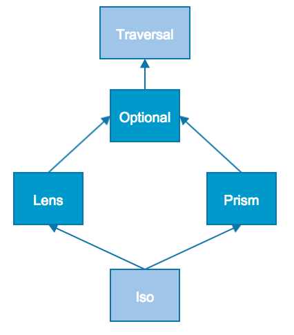

#  Optics Introduction

---

# Lens => Product Type

```scala
trait Lens[S, A]{

  def get(s: S): A

  def set(a: A)(s: S): S

  def modify(f: A => A)(s: S): S
  
  def compose[B](other: Lens[A, B]): Lens[S, B]
}
```
---

# Lens Laws

```scala


∀ s: S        => set(get(s))(s) == s 

∀ s: S, a: A  => get(set(a)(s)) == a 

∀ s: S, a: A  => set(s)(set(a)(s)) == set(a)(s) 

∀ s: S        => modify(id)(s)  == s 
```

---

# Nested case class with std Scala

```scala
case class AppConfig(switches: Switches, client: ClientConfig)
case class Switches(useFeature1: Boolean, useFeature2: Boolean)
case class ClientConfig(endPoint: EndPointConfig, appId: String)
case class EndPointConfig(protocol: String, host: String, port: Int)

val config: AppConfig = ...

config.client.endpoint.port // 8080

config.copy(
  client = config.client.copy(
    endpoint = config.client.endpoint.copy(
      port = 5000
    )
  )
)
```

---

# Nested case class with Monocle

```scala


import monocle.macro.Lenses
@Lenses case class AppConfig(client: ClientConfig, switches: Switches)
...

import AppConfig._, Switches._, ClientConfig._, EndPointConfig._
val newConfig = (client compose endPoint compose port).set(9999)(config)


(client compose endPoint compose port).get(newConfig) // 9999
```

---

# More powerful Lens examples

```scala
def toggleFeature1(config: AppConfig): AppConfig =
  config.copy( 
    switches = config.switches.copy(
      useFeature1 = ! config.swicthes.useFeature1
    )
  )

def toggle(feature: Lens[Switches, Boolean]): AppConfig => AppConfig =
  (switches compose feature).modify(b => ! b)

toggle(useFeature1)(config)

val toggleAllFeatures: AppConfig => AppConfig = 
  toggle(useFeature1) . toggle(useFeature2)

toggleAllFeatures(config)

```

---

# Lens Limitations

```scala
type Option[A] = Some[A](value: A) | None

def some[A]: Lens[Option[A], A] = ??? 

some.get(None) = ???


type Json = JsNumber(d: Double) | JsBool(b: Boolean) | ...
```

---

# Prism => Sum Type

```scala
trait Prism[S, A]{

  def getOption(s: S): Option[A]

  def reverseGet(a: A): S

  def modify(f: A => A)(s: S): S
  
  def compose[B](other: Prism[A, B]): Prism[S, B]
}
```

---

# Prism Laws

```scala

∀ a: A => getOption(reverseGet(a)) == Some(a)

∀ s: S => getOption(s).map{
   case Some(a) => reverseGet(a) == s
   case None    => true
 }

∀ s: S        => modify(id)(s)  == s      
```

---

# Laws => Automatic Testing

```scala
∀ s: S => getOption(s).map{
   case Some(a) => reverseGet(a) == s
   case None    => true
 }
                                     
val stringToInt = Prism[String, Int](s => Try(s.toInt).toOption)(_.toString)

stringToInt.getOption("12345")  == Some(12345)
stringToInt.getOption("-12345") == Some(-12345)
stringToInt.getOption("hello")  == None
stringToInt.getOption("999999999999999999") == None

stringToInt.modify(_ * 2)("1234") == "2468"
```

---

# Laws => Automatic Testing

```scala


stringToInt.getOption("꩙") == Some(9) // WTF???

```

---

# Prism Examples

```scala
def cons[A] = Prism[List[A], (A, List[A])]{
  case Nil     => None
  case x :: xs => Some((x, xs))
}{ case (h, t) => h :: t }

cons.getOption(List(1,2,3)) == Some((1, List(2, 3)))
cons.getOption(Nil)         == None

cons.reverseGet((0, List(1, 2))) == List(0, 1, 2)
```

---

# Prism Examples

```scala
def some[A] = Prism[Option[A], A](identity)(Some(_))

some.getOption(Some(3)) == Some(3)
some.getOption(None)    == None

some.reverseGet(3) == Some(3)

some.modify(_ + 1)(Some(3)) == Some(4)
some.modify(_ + 1)(None)    == None
```

---

# Prism Limitations

```scala

val l: List[Char] = List('a', 'b', 'c')

def index[A](i: Int): Prism[List[A], A] = ???

index(1).getOption(l) == Some('b')
index(9).getOption(l) == None

index(2).set('l')(l) == List('a', 'b', 'l')

index(1).reverseGet('b') == ???

```

---

# Optics Composition

```scala


 Lens[S, A] compose Prism[A, B] = ???[S, B]
Prism[S, A] compose  Lens[A, B] = ???[S, B]

val example = Person("John", 25, Some("john@gmail.com"))

val email: Lens[Person, Option[String]] = ...

(email compose some): ???[Person, String]

```

---

# Optional

```scala
trait Optional[S, A]{

  def getOption(s: S): Option[A]
  
  def set(a: A)(s: S): S

  def modify(f: A => A)(s: S): S
  
  def compose[B](other: Optional[A, B]): Optional[S, B]
  def compose[B](other:     Lens[A, B]): Optional[S, B]
  def compose[B](other:    Prism[A, B]): Optional[S, B]
}        
```

---



---

# Optional Laws

```scala

∀ s: S => getOption(s).map{
   case Some(a) => set(a)(s) == s
   case None    => true
 }
∀ s: S => getOption(set(a)(s)) == getOption(s).map(_ => a) 

∀ s: S, a: A  => set(set(a)(s), s) == set a s 
∀ s: S        => modify(id)(s)  == s      
```

---

# Json Example

```scala
sealed trait Json
case class JsNumber(value: Double)            extends Json
case class JsString(value: String)            extends Json
case class JsArray(value: List[Json])         extends Json
case class JsObject(value: Map[String, Json]) extends Json

val jsNumber: Prism[Json, Double] = ...
val jsArray : Prism[Json, List[Json]] = ...
```

---

# Json Example

```scala
val json: Json = JsObject(Map(
  "first_name" -> JsString("John"),
  "last_name"  -> JsString("Doe"),
  "age"        -> JsNumber(26),
  "siblings"   -> JsArray(List(
    JsObject(Map(
      "first_name" -> JsString("Zoe"),
      "age"        -> JsNumber(21)
    )),
    JsObject(Map(
      "first_name" -> JsString("Bill"),
      "age"        -> JsNumber(23)
    ))
  ))
))
```

---

# Json Example

```scala
   
import monocle.function._
   
(jsObject compose index("first_name") compose jsString).getOption(json) == Some("John")
   
(jsObject 
  compose index("siblings") compose jsArray
  compose index(1)          compose jsObject
  compose index("age")      compose jsNumber
).modify(_ + 1)(json)
          
(jsObject compose filterIndex(_.contains("name"))
          compose jsString
).modify(_.toLowerCase)(json)
```

---

# Erratum


*   Most Optics have 4 type parameters instead of 2 with "simple" type alias: Lens[S, A] == PLens[S, S, A, A]
*   Type inference issues with compose forced us to create non overloaded compose versions: composeLens, composePrism, composeOptional ...
*   Macros are awesome but IDE support is limited


---

# Links

[[1]](https://github.com/julien-truffaut/Monocle) Monocle github project

[[2]](http://functional-wizardry.blogspot.co.uk/2014/02/lens-implementation-part-1.html) Blog post explaining Lens implementation in Monocle

[[3]](https://skillsmatter.com/skillscasts/4251-lenses-compositional-data-access-and-manipulation) Simon Peyton Jones presentation of Lens library at the London Scala exchange 2013

[[4]](https://dl.dropboxusercontent.com/u/7810909/media/doc/lenses2.pdf) Tony Morris history of Lenses history

[[5]](https://www.youtube.com/watch?v=efv0SQNde5Q) Edward Kmett video of how to use Lenses with State Monad
